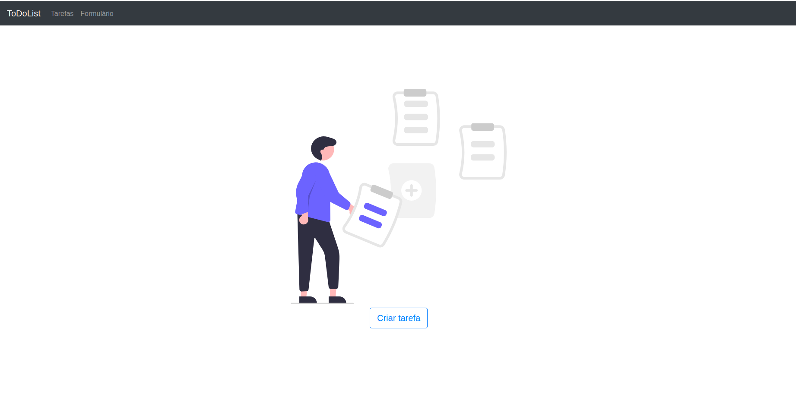
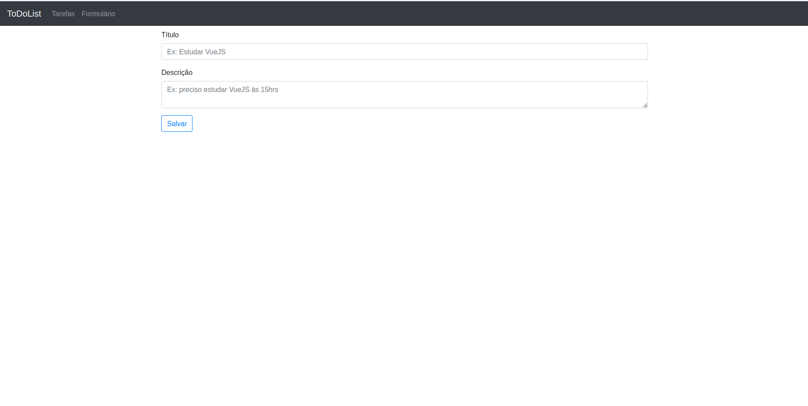
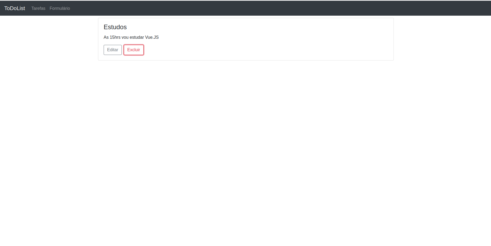
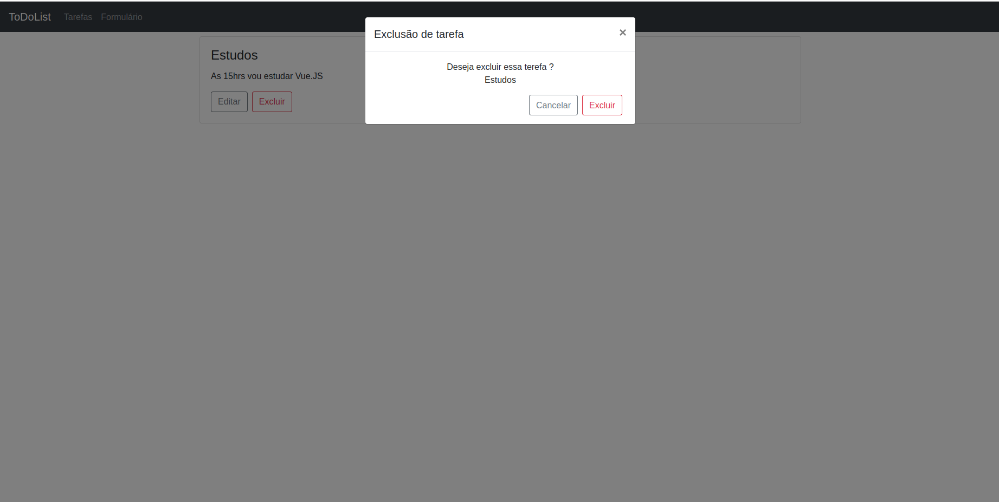

# To Do List. 📝
## Tasks

## Form

## List

## Modal


## Project description:

### The purpose of the project is to create a to-do list to organize work and life;

- [x] Tasks / Edit || Delete(Modal)
- [x] Form / Save

## Technologies I used for the project;

<div style="display: inline_block"><br>
 
   
</div>

### Stylization Language;

<div style="display: inline_block">
    
</div>

## Project setup
```
npm install
```

### Compiles and hot-reloads for development
```
npm run serve
```

### Compiles and minifies for production
```
npm run build
```

### Customize configuration
See [Configuration Reference](https://cli.vuejs.org/config/).
